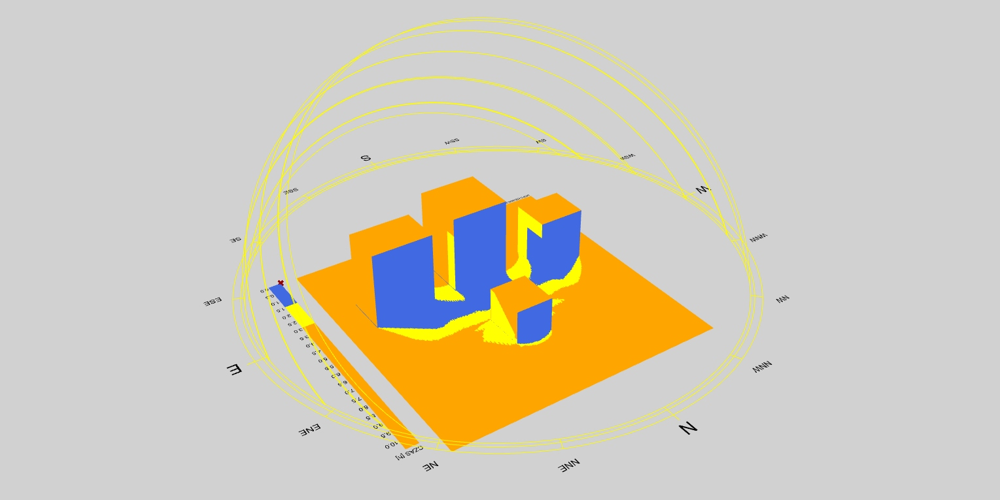

# Accurate_Polish_sunlight_hours_compilance
 Rhino Grasshopper/Ladybug daylight analysys definition

 

This definition generate map of time that shadow occur in speciffied area. 
Default time are spring and autumn eqquinox.

Definition accept multiple breps.

## Install
Requirements:

[Rhino 7](https://www.rhino3d.com/7)

[Ladybug Tools 1.6.0](https://www.food4rhino.com/en/app/ladybug-tools) with dependencies.

[Human](https://www.food4rhino.com/en/app/human)

[Human UI](https://www.food4rhino.com/en/app/human-ui)

## Disclaimer
Ladybug Tools is licensed under the [GNU General Public License (GPL) Version 3](https://www.gnu.org/licenses/gpl-3.0.en.html)

[GPLv3](https://www.gnu.org/licenses/gpl-3.0.en.html) @ jacekmlk
